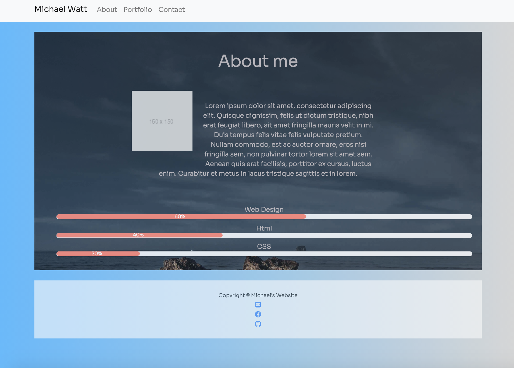
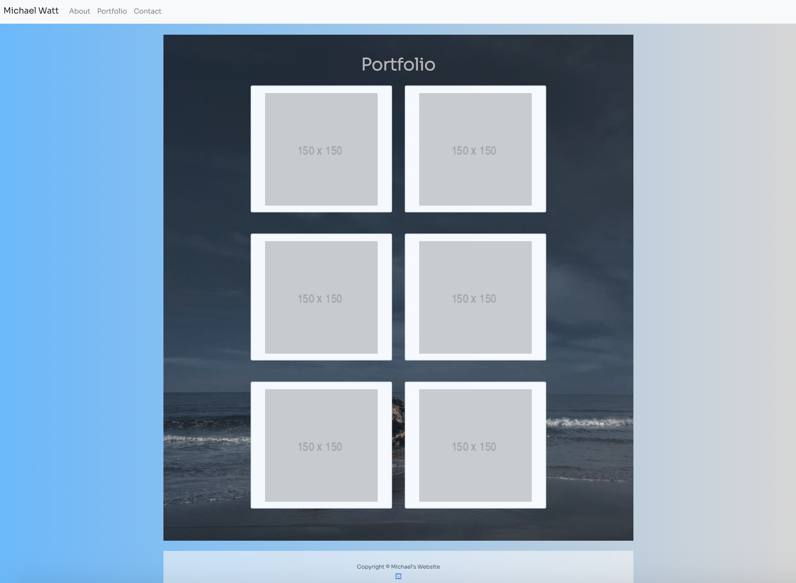
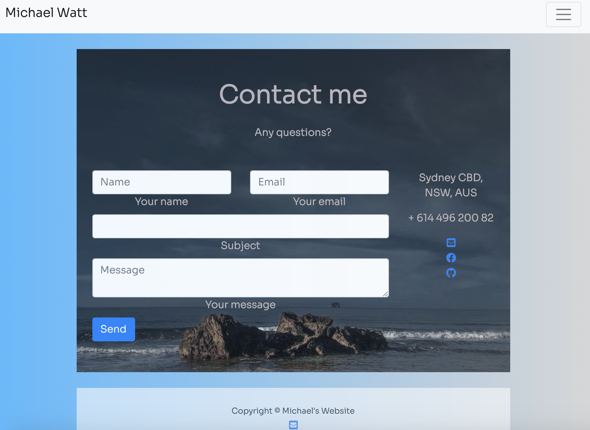

# Responsive Portfolio

## Contents

The app is composed of 4 pages, index.html, portfolio.html, contact.html and style.css. It also has images in the img folder.

## User Story

As a type of user, I want to perform portfolio task so that I can achieve some goals.

## Built With

- [VScode](https://code.visualstudio.com/) - The editor of choice
- [Terminal](https:///) - What would we do without our bash?

#### Initial interface

#### Final Interface

-

### Licence

No license due to nature of project

### Link to the App

## Authors

- **Michael Watt** 

Contact information

GitHub: [@Michaelmw17](https://github.com/Michaelmw17/w8homework)

Email: Michaelmw17@outlook.com

## Acknowledgments

- textContent vs innerHTML/innerText

  - https://developer.mozilla.org/en-US/docs/Web/API/Element/innerHTML
  - https://developer.mozilla.org/en-US/docs/Web/API/Node/textContent#Differences_from_innerText
